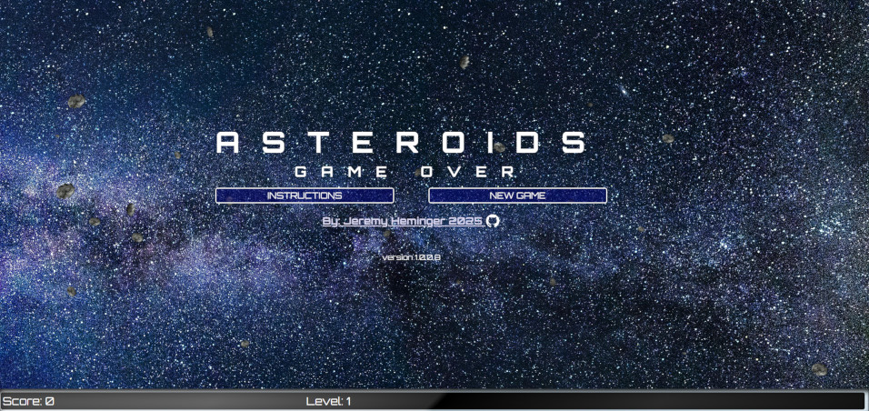

# Asteroids !!

## Jeremy Heminger <contact@jeremyheminger.com>

	ᓚᘏᗢ

#### Built without AI  *mostly*  - sort of an homage to : [Kickass!](https://kickassapp.com)
I originally built a little easter egg into an intranet app at work. In the login if the user gave the secret user name and password that was *not very* surreptitiously nested in the HTML source of the login page, then a simple Asteroids game would appear. However once I started playing with it, *over time*, it started to evolve into a project at home on my own time.

|  | |  |

[Online DEMO](https://demo.jeremyheminger.com/asteroids/)

[Versions](versions.md)

[TODO list](todo.md)

Development uses [GRUNT](https://gruntjs.com/).
Start by running:

	npm update

from the terminal then:

	grunt

#### 💧 Typescript
#### 💧 SASS

The working files are in the [/_](_) directory.

There is a sample config file in [/local](local) as well as the assets.

